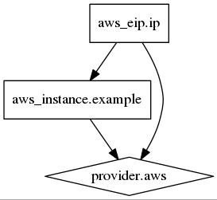

## terraform plan
``` bash
$ terraform plan
...
+ aws_eip.ip
    allocation_id:  "" => "<computed>"
    association_id: "" => "<computed>"
    domain:         "" => "<computed>"
    instance:       "" => "${aws_instance.example.id}"
    private_ip:     "" => "<computed>"
    public_ip:      "" => "<computed>"

+ aws_instance.example
    ami:                 "" => "ami-aa7ab6c2"
    availability_zone:   "" => "<computed>"
    block_device.#:      "" => "<computed>"
    instance_type:       "" => "t1.micro"
    key_name:            "" => "<computed>"
    private_dns:         "" => "<computed>"
    private_ip:          "" => "<computed>"
    public_dns:          "" => "<computed>"
    public_ip:           "" => "<computed>"
    root_block_device.#: "" => "<computed>"
    security_groups.#:   "" => "<computed>"
    subnet_id:           "" => "<computed>"
    tenancy:             "" => "<computed>"
```

## terraform graph
``` bash
$ terraform graph | dot -Tjpeg >simple.jpeg
```


