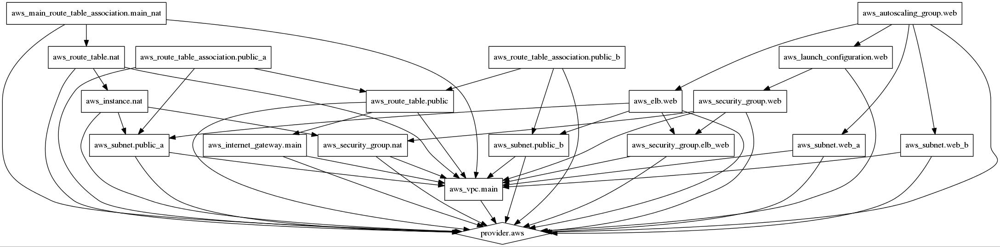

# Terraform VPC Example

Here is a basic idea of what we will be building

[vpc-architecture.png](./img/vpc-architecture.png)


## terraform plan
Example plan phase run against a clean environment

```bash
$ terraform plan
(...)
+ aws_autoscaling_group.web
    availability_zones.#:          "" => "2"
    availability_zones.3569565595: "" => "us-east-1a"
    availability_zones.986537655:  "" => "us-east-1c"
    default_cooldown:              "" => "<computed>"
    desired_capacity:              "" => "2"
    force_delete:                  "" => "1"
    health_check_grace_period:     "" => "300"
    health_check_type:             "" => "ELB"
    launch_configuration:          "" => "web"
    load_balancers.#:              "" => "<computed>"
    max_size:                      "" => "4"
    min_size:                      "" => "2"
    name:                          "" => "web"
    termination_policies.#:        "" => "<computed>"
    vpc_zone_identifier.#:         "" => "<computed>"

+ aws_elb.web
    availability_zones.#:                        "" => "<computed>"
    cross_zone_load_balancing:                   "" => "1"
    dns_name:                                    "" => "<computed>"
    health_check.#:                              "" => "1"
    health_check.2850906033.healthy_threshold:   "" => "2"
    health_check.2850906033.interval:            "" => "30"
    health_check.2850906033.target:              "" => "HTTP:80/"
    health_check.2850906033.timeout:             "" => "3"
    health_check.2850906033.unhealthy_threshold: "" => "2"
    instances.#:                                 "" => "<computed>"
    internal:                                    "" => "<computed>"
    listener.#:                                  "" => "1"
    listener.3057123346.instance_port:           "" => "80"
    listener.3057123346.instance_protocol:       "" => "http"
    listener.3057123346.lb_port:                 "" => "80"
    listener.3057123346.lb_protocol:             "" => "http"
    listener.3057123346.ssl_certificate_id:      "" => ""
    name:                                        "" => "web"
    security_groups.#:                           "" => "<computed>"
    subnets.#:                                   "" => "<computed>"

+ aws_instance.nat
    ami:                 "" => "ami-224dc94a"
    availability_zone:   "" => "<computed>"
    block_device.#:      "" => "<computed>"
    instance_type:       "" => "m1.small"
    key_name:            "" => "terraform"
    private_dns:         "" => "<computed>"
    private_ip:          "" => "<computed>"
    public_dns:          "" => "<computed>"
    public_ip:           "" => "<computed>"
    root_block_device.#: "" => "<computed>"
    security_groups.#:   "" => "<computed>"
    source_dest_check:   "" => "0"
    subnet_id:           "" => "${aws_subnet.public_a.id}"
    tenancy:             "" => "<computed>"

+ aws_internet_gateway.main
    tags.#:    "0" => "1"
    tags.Name: "" => "main"
    vpc_id:    "" => "${aws_vpc.main.id}"

+ aws_launch_configuration.web
    associate_public_ip_address: "" => "0"
    image_id:                    "" => "ami-aa7ab6c2"
    instance_type:               "" => "t1.micro"
    key_name:                    "" => "terraform"
    name:                        "" => "web"
    security_groups.#:           "" => "<computed>"
    user_data:                   "" => "163593951bc560a38382bc38e0f72b8b74bcf376"

+ aws_main_route_table_association.main_nat
    original_route_table_id: "" => "<computed>"
    route_table_id:          "" => "${aws_route_table.nat.id}"
    vpc_id:                  "" => "${aws_vpc.main.id}"

+ aws_route_table.nat
    route.#:                                     "" => "1"
    route.~3508085667.cidr_block:                "" => "0.0.0.0/0"
    route.~3508085667.gateway_id:                "" => ""
    route.~3508085667.instance_id:               "" => "${aws_instance.nat.id}"
    route.~3508085667.vpc_peering_connection_id: "" => ""
    tags.#:                                      "" => "1"
    tags.Name:                                   "" => "nat"
    vpc_id:                                      "" => "${aws_vpc.main.id}"

+ aws_route_table.public
    route.#:                                     "" => "1"
    route.~2824985194.cidr_block:                "" => "0.0.0.0/0"
    route.~2824985194.gateway_id:                "" => "${aws_internet_gateway.main.id}"
    route.~2824985194.instance_id:               "" => ""
    route.~2824985194.vpc_peering_connection_id: "" => ""
    tags.#:                                      "" => "1"
    tags.Name:                                   "" => "public"
    vpc_id:                                      "" => "${aws_vpc.main.id}"

+ aws_route_table_association.public_a
    route_table_id: "" => "${aws_route_table.public.id}"
    subnet_id:      "" => "${aws_subnet.public_a.id}"

+ aws_route_table_association.public_b
    route_table_id: "" => "${aws_route_table.public.id}"
    subnet_id:      "" => "${aws_subnet.public_b.id}"

+ aws_security_group.elb_web
    description:                          "" => "security group for web elbs"
    egress.#:                             "" => "<computed>"
    ingress.#:                            "" => "2"
    ingress.2603706321.cidr_blocks.#:     "" => "1"
    ingress.2603706321.cidr_blocks.0:     "" => "0.0.0.0/0"
    ingress.2603706321.from_port:         "" => "80"
    ingress.2603706321.protocol:          "" => "tcp"
    ingress.2603706321.security_groups.#: "" => "0"
    ingress.2603706321.self:              "" => "0"
    ingress.2603706321.to_port:           "" => "80"
    ingress.4089093546.cidr_blocks.#:     "" => "1"
    ingress.4089093546.cidr_blocks.0:     "" => "0.0.0.0/0"
    ingress.4089093546.from_port:         "" => "443"
    ingress.4089093546.protocol:          "" => "tcp"
    ingress.4089093546.security_groups.#: "" => "0"
    ingress.4089093546.self:              "" => "0"
    ingress.4089093546.to_port:           "" => "443"
    name:                                 "" => "elb_web"
    owner_id:                             "" => "<computed>"
    vpc_id:                               "" => "${aws_vpc.main.id}"

+ aws_security_group.nat
    description:                          "" => "nat security group"
    egress.#:                             "" => "1"
    egress.4092576624.cidr_blocks.#:      "" => "1"
    egress.4092576624.cidr_blocks.0:      "" => "0.0.0.0/0"
    egress.4092576624.from_port:          "" => "0"
    egress.4092576624.protocol:           "" => "tcp"
    egress.4092576624.security_groups.#:  "" => "0"
    egress.4092576624.self:               "" => "0"
    egress.4092576624.to_port:            "" => "65535"
    ingress.#:                            "" => "1"
    ingress.4092576624.cidr_blocks.#:     "" => "1"
    ingress.4092576624.cidr_blocks.0:     "" => "0.0.0.0/0"
    ingress.4092576624.from_port:         "" => "0"
    ingress.4092576624.protocol:          "" => "tcp"
    ingress.4092576624.security_groups.#: "" => "0"
    ingress.4092576624.self:              "" => "0"
    ingress.4092576624.to_port:           "" => "65535"
    name:                                 "" => "nat"
    owner_id:                             "" => "<computed>"
    vpc_id:                               "" => "${aws_vpc.main.id}"

+ aws_security_group.web
    description:                           "" => "security group for web servers"
    egress.#:                              "" => "<computed>"
    ingress.#:                             "" => "2"
    ingress.~1712012281.cidr_blocks.#:     "" => "0"
    ingress.~1712012281.from_port:         "" => "22"
    ingress.~1712012281.protocol:          "" => "tcp"
    ingress.~1712012281.security_groups.#: "" => "<computed>"
    ingress.~1712012281.self:              "" => "0"
    ingress.~1712012281.to_port:           "" => "22"
    ingress.~3060235763.cidr_blocks.#:     "" => "0"
    ingress.~3060235763.from_port:         "" => "80"
    ingress.~3060235763.protocol:          "" => "tcp"
    ingress.~3060235763.security_groups.#: "" => "<computed>"
    ingress.~3060235763.self:              "" => "0"
    ingress.~3060235763.to_port:           "" => "80"
    name:                                  "" => "web"
    owner_id:                              "" => "<computed>"
    vpc_id:                                "" => "${aws_vpc.main.id}"

+ aws_subnet.public_a
    availability_zone:       "" => "us-east-1a"
    cidr_block:              "" => "10.0.0.0/24"
    map_public_ip_on_launch: "" => "1"
    tags.#:                  "" => "1"
    tags.Name:               "" => "public_a"
    vpc_id:                  "" => "${aws_vpc.main.id}"

+ aws_subnet.public_b
    availability_zone:       "" => "us-east-1c"
    cidr_block:              "" => "10.0.1.0/24"
    map_public_ip_on_launch: "" => "1"
    tags.#:                  "" => "1"
    tags.Name:               "" => "public_b"
    vpc_id:                  "" => "${aws_vpc.main.id}"

+ aws_subnet.web_a
    availability_zone:       "" => "us-east-1a"
    cidr_block:              "" => "10.0.2.0/24"
    map_public_ip_on_launch: "" => "<computed>"
    tags.#:                  "" => "1"
    tags.Name:               "" => "web_a"
    vpc_id:                  "" => "${aws_vpc.main.id}"

+ aws_subnet.web_b
    availability_zone:       "" => "us-east-1c"
    cidr_block:              "" => "10.0.3.0/24"
    map_public_ip_on_launch: "" => "<computed>"
    tags.#:                  "" => "1"
    tags.Name:               "" => "web_b"
    vpc_id:                  "" => "${aws_vpc.main.id}"

+ aws_vpc.main
    cidr_block:                "" => "10.0.0.0/16"
    default_network_acl_id:    "" => "<computed>"
    default_security_group_id: "" => "<computed>"
    enable_dns_hostnames:      "" => "<computed>"
    enable_dns_support:        "" => "<computed>"
    main_route_table_id:       "" => "<computed>"
    tags.#:                    "" => "1"
    tags.Name:                 "" => "main"
```

## terraform graph
Example graph phase against a clean environment

```bash
$ terrafrom graph | dot -Tjpeg > vpc.jpeg
```

